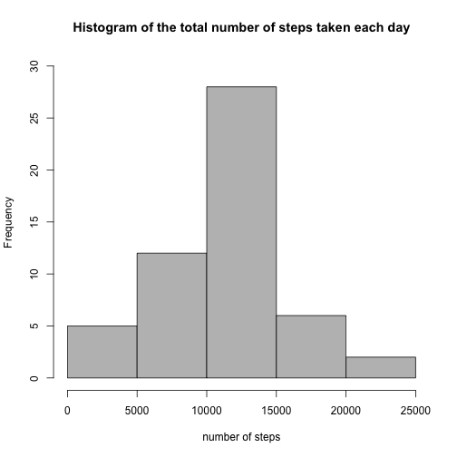
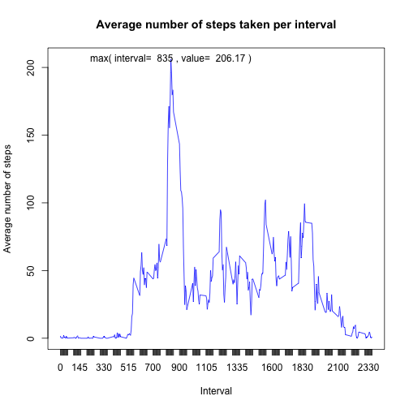
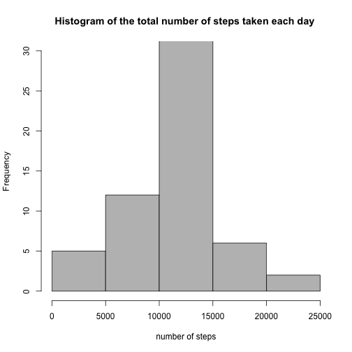
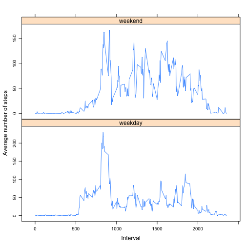

Reproducible Research: Peer Assessment 1
==================================================


##Loading and preprocessing the data


```r
activity<-read.csv("activity.csv")
# getting rid of NA values
activity_complete_cases<-na.omit(activity)
```


##What is mean total number of steps taken per day?

```r
#aggregating daily numbers of steps 
steps_daily<-aggregate(activity_complete_cases$steps,by=list(activity_complete_cases$date),FUN=sum)
names(steps_daily)<-c("date","steps")
#plotting a histogram 
hist(steps_daily$steps,breaks="Sturges",main = ("Histogram of the total number of steps taken each day" ),ylim = range(0,30),xlab="Number of steps",col=c("grey"))
```

 

```r
#mean and median of the total number of steps taken per day
mean(steps_daily$steps)
```

```
## [1] 10766.19
```

```r
median(steps_daily$steps)
```

```
## [1] 10765
```


##What is the average daily activity pattern?

```r
#aggregating numbers of steps across 5-minute intervals
steps_intervals<-aggregate(activity_complete_cases$steps,by=list(activity_complete_cases$interval),FUN=mean)
names(steps_intervals)<-c("interval","steps")
#plotting average number of steps taken per interval for the entire dateset
plot(steps_intervals$interval,steps_intervals$steps,ylim=c(min(steps_intervals$steps),max(steps_intervals$steps)),type="l",col="blue",ylab="Average number of steps",  xlab="Interval",main="Average number of steps taken per interval",xaxt="n") 
axis(1,steps_intervals$interval)
text(steps_intervals$interval[which.max(steps_intervals$steps)],max(steps_intervals$steps),paste("max( interval= ",steps_intervals$interval[which.max(steps_intervals$steps)],", value= ",round(max(steps_intervals$steps),2),")"))
```

 

```r
#Which 5-minute interval, on average across all the days in the dataset, contains the maximum number of steps?
steps_intervals$interval[which.max(steps_intervals$steps)]
```

```
## [1] 835
```

##Imputing missing values

```r
#Calculate and report the total number of missing values in the dataset (i.e. the total number of rows with NAs)
length(which(is.na(activity$steps)))
```

```
## [1] 2304
```

```r
#filling in NA values with the means for the corresponding 5-minute interval
ns<-sapply(1:nrow(activity),function(i) {ifelse(is.na(activity$steps[i]),activity$steps[i]<-steps_intervals$steps[which(activity$interval[i]==steps_intervals$interval)],activity$steps[i])})
#constructing a new dataframe
activity_without_NA<-data.frame(data.frame(ns),activity$date,activity$interval)
names(activity_without_NA)<-c("steps","date","interval")
steps_daily_without_NA<-aggregate(activity_without_NA$steps,by=list(activity_without_NA$date),FUN=sum)
names(steps_daily_without_NA)<-c("date","steps")
#plotting a new  histogram
hist(steps_daily_without_NA$steps,breaks="Sturges",main = ("Histogram of the total number of steps taken each day " ),ylim = range(0,30),xlab="Number of steps",col=c("grey"))
```

 

```r
#mean and median of the total number of steps taken per day (with imputing NA values)
mean(steps_daily_without_NA$steps)
```

```
## [1] 10766.19
```

```r
median(steps_daily_without_NA$steps)
```

```
## [1] 10766.19
```
Imputing NA values doesn't deliver any difference with respect to the first  part of the assignment. Thus the impact is negligible, if any.


##Are there differences in activity patterns between weekdays and weekends?

```r
#converting dates into weekdays
wd<-data.frame(weekdays(as.Date(as.character(activity_without_NA$date))))
names(wd)<-c("day")
wd$day<-data.frame(sapply(wd$day,function(x){ifelse(((x=="Sunday")||(x=="Saturday")),"weekend","weekday")}))
#constructing a new dataframe with the factor variable designating weekend or weekday
activity_days<-data.frame(activity_without_NA,wd$day)
colnames(activity_days)[4]<-"day"
#aggregating numbers of steps across 5-minute intervals
steps_interval_day<-aggregate(activity_days$steps,by=list(activity_days$day,activity_days$interval),FUN=mean)
names(steps_interval_day)<-c("day","interval","steps")
#creating multiple plot in lattice
library(lattice)
xyplot(steps_interval_day$steps~steps_interval_day$interval|steps_interval_day$day,type="l",layout=c(1,2),scales=list(y=list(relation="free")),ylab="Average number of steps",xlab="Interval")
```

 


